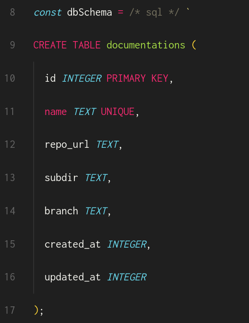

RAG - Configuration and Database
---

This is the third article of a series in which I am building an open source RAG CLI tool. In the [previous article](2.cli-interface.md) we designed and started the implementation of the command line interface of the tool.

In this article, we will design the database to store the documentations and create a configuration file in the process.

# The database schema

We already chose SQLite as a database, so let's define the tables we need.

The first table is **documentations**, it will store the docs information like name, repo url, subdir, branch, etc.
```
id int primary key
name text unique
repo_url text
subdir text
branch text
created_at timestamp
updated_at timestamp
```

When we run the `rag docs add ...`, a new row will be added to the `documentations` table, then we will fetch the markdown files from the given repo. So a **files** table makes sense.
```
id int primary key
documentation_id int
path text
hash text
created_at timestamp
updated_at timestamp
```

The `path` is the file path within the git repo. The `hash` is a hash of the file content.

> Why do we need to store the file hash?

it will be useful when we do `rag docs update`, we can then fetch the new files and if we detect that the hash didn't change, we know that the file content didn't change, so we don't have to re-split it and update its chunks.

> Hmm, then why don't we just store the old file content and compare with the new one directly?

The content of files will be stored as separate chunks, I think it's not worth it to also store them as a whole in the files table. This might just make the database larger for no useful reason.

The next table is **chunks**, it will store the chunks of the files.
```
id int primary key
file_id int
index int
metadata text
content text
embedding blob
created_at timestamp
updated_at timestamp
```
- `index` is the index of the chunk in the file, this maybe useful if we want to contruct the full file content from the chunks.
- `metadata` will contain meta information about the chunk (I will define these metadata in details when we implement the `rag docs add` command).
- `embedding` will store the embedding vector of the chunk.

# Creating the database

Now that we have defined the database tables, it's time to write the code that will create the database when the user runs the first `rag` command. So as part of the initial checks that will be performed by all commands, is to check if the database exists and if not, create it.

So let's create a function init in `src/init.ts` to do that:

```ts
import * as db from './database'

export async function init() {
  if (!db.exists()) {
    await db.create()
  }
}
```

and use it in `src/main.ts`:

```ts
import { program } from 'commander'
import { init } from './init'

program.name('rag').version('0.0.1').description('Simple RAG system for developers')

// ...

init().then(() => program.parseAsync()).catch((err) => {
  console.error(err)
  process.exit(1)
})
```

Now let's create a `src/db.ts` file and implement the `exists` and `create` functions:

```ts
import os from 'os'
import path from 'path'
import { Database } from 'bun:sqlite'

const db_path = path.join(os.homedir(), '.rag/db.sqlite')

const db_schema = /* sql */ `
CREATE TABLE documentations (
  id INTEGER PRIMARY KEY,
  name TEXT UNIQUE,
  repo_url TEXT,
  subdir TEXT,
  branch TEXT,
  created_at INTEGER,
  updated_at INTEGER
);

CREATE TABLE files (
  id INTEGER PRIMARY KEY,
  documentation_id INTEGER,
  path TEXT,
  hash TEXT,
  created_at INTEGER,
  updated_at INTEGER
);

CREATE TABLE chunks (
  id INTEGER PRIMARY KEY,
  file_id INTEGER,
  index INTEGER,
  metadata TEXT,
  content TEXT,
  embedding BLOB,
  created_at INTEGER,
  updated_at INTEGER
);
`

export async function exists() {
  return Bun.file(db_path).exists()
}

export async function create() {
  await mkdir(path.dirname(db_path), { recursive: true })
  const db = new Database(db_path)
  db.transaction(() => {
    db.prepare(db_schema).run()
  })()
}
```

> Hooold on, I have many questions about this code:
> 1. Why don't you use camelCase for the function names? isn't it the standard in Typescript?

Yes camelCase is the standard in Typescript, and I would use it if I was working within a team or on a code that will be called by other devs (a library). But here I am working alone and building a CLI, so I think I am free to use my preferred style. I find `snake_case` to be more readable then `camelCase`.

> 2. The comment in the line `const db_schema = /* sql */ ` is weirdly placed, comments are normally written before the line or at the end of it, not in the middle.

I am using an extension that enables syntax highlighting within string templates, that comment specifies the language for the syntax.



> 3. I am not a fan of writing SQL code like that, it's error prone and hard to maintain, why don't you use a library like prisma or drizzle to handle this?

because I like to keep things simple and have control over my code. Every ORM comes with abstractions and some magic, so before I use it, I need to learn about how it works, what kind of queries it will generate, what are the assumptions and limitations ... I don't think it's worth it for this project, as I can write the SQL queries in less time.

> But you only need to learn about the ORM once, and then you can use it for all your projects.

Yes, that's correct. if I wasn't in a hurry, I would spend more time learning it as an investment for future projects, or just out of curiosity. But I want to finish this tool as soon as possible and move on to the next project (I have a long waiting list that keeps growing ...).

> 4. The `created_at` and `updated_at` columns should be dates or timestamps, not integers, isn't it?

In other SQL databases, like MySQL and Postgres, yes that would be the case. But I just learned that SQLite only supports **5 datatypes**: `NULL`, `INTEGER`, `REAL`, `TEXT` and `BLOB`.

From the [SQLite datatypes documentation](https://www.sqlite.org/datatype3.html):

> SQLite does not have a storage class set aside for storing dates and/or times. Instead, the built-in [Date And Time Functions](https://www.sqlite.org/lang_datefunc.html) of SQLite are capable of storing dates and times as TEXT, REAL, or INTEGER values:
> - TEXT as ISO8601 strings ("YYYY-MM-DD HH:MM:SS.SSS").
> - REAL as Julian day numbers, the number of days since noon in Greenwich on November 24, 4714 B.C. according to the proleptic Gregorian calendar.
> - INTEGER as Unix Time, the number of seconds since 1970-01-01 00:00:00 UTC.
> Applications can choose to store dates and times in any of these formats and freely convert between formats using the built-in date and time functions.

So I chose to use integers for timestamps, and store the Unix timestamp in seconds.

> That's weird, I have seen SQLite code that uses other types like `DATETIME`, `VARCHAR(255)` and `FLOAT[100]`.

SQLite will accept any string as the column type (as long as the table is not in [strict mode](https://www.sqlite.org/stricttables.html)) and will automatically map it to one of the 5 datatypes above. For example:
- `VARCHAR(255)` will be `TEXT`
- `FLOAT[100]` will be `BLOB`
- `DATETIME` will be `INTEGER`

I will not go deep into the conversion rules, but you can check details here: https://www.sqlite.org/datatype3.html

> 6. I see that you hard coded the database path, is there a way to make it configurable?

Yes, that's the next step.

# Adding a configuration file

Before continuing with the database, let's add a configuration file that will store the database path and other settings we may add later.
We want to allow the user to change this file as they want, so instead of having a file in the source code (that will be compiled into a single executable), we will use a file in the user's home directory, let the path be `~/.rag/config.yaml` (I chose YAML over JSON because I find it easier to write and read).

For now, a config file will look something like this:
```yaml
database_path: ~/.rag/db.sqlite
```

Then we need some functions in our code to read and update that file, let's create a `src/config.ts` file:

```ts
import os from 'os'
import path from 'path'
import yaml from 'yaml'

export type Config = {
  database_path: string
}

const config_path = path.join(os.homedir(), '.rag/config.yaml')
const defaults: Config = {
  database_path: path.join(os.homedir(), '.rag/db.sqlite'),
}

export async function get() {
  if (!(await exists())) {
    await set(defaults)
    return defaults
  }
  return yaml.parse(await Bun.file(config_path).text())
}

export async function set(config: Config) {
  await Bun.write(config_path, yaml.stringify(config))
}

async function exists() {
  return Bun.file(config_path).exists()
}
```
This file exports the `Config` type, and the functions `get` and `set` to read and write the config.

> I think calling the functions `get_config` and `set_config` is more readable than `get` and `set` in this case.

Let's talk about that. I tend to only add such prefixes to names (of variables, functions, classes, etc) when necessary. Most of the time, it's not.
In this case, we are already inside the `config.ts` file, so we don't need to specify it again in the function names.
You may say, "but what about when using the functions in other files?", then I will do the following:

```ts
import * as config from './config'

config.get() // to get the config
config.set(...) // to set the config
```

> Hmm, interesting, so you use `import * as` just to avoid prefixing the function names?

Not only that, but also because I don't remember all the exported functions in the file/module, with this import I can type `config.` and let the IDE list all the functions for me.
I am not saying this approach is the best, it's just how I like to write/organize my code :P

> Understood. Now I see another problem with that code; We don't validate the config after reading and before writing it. What happens if the user has a typo in the config file?

You are right, we should validate the config at runtime and show a proper error message if it's not valid.
I will add the validation now using `zod` and handle the proper error messages later (I will just print the Zod error directly to stderr for now).

```ts
import z from 'zod'

const Config = z.object({
  database_path: z.string(),
})
export type Config = z.infer<typeof Config>

export async function get() {
  // ...
  return Config.parse(yaml.parse(await Bun.file(config_path).text()))
}

export async function set(config: Config) {
  await Bun.write(config_path, yaml.stringify(Config.parse(config)))
}
```

Let's use the database path from the config file in the database functions:

```ts
import * as config from './config'

export async function exists() {
  const { database_path } = await config.get()
  return Bun.file(database_path).exists()
}

export async function create() {
  const { database_path } = await config.get()
  await mkdir(path.dirname(database_path), { recursive: true })
  const db = new Database(database_path)
  db.transaction(() => {
    db.prepare(db_schema).run()
  })()
}
```

Here I notice that we are calling `config.get` twice, and we are reading and parsing the yaml file each time. Let's read the config once and store it:

```ts
let config: Config | undefined

export async function get() {
  if (config === undefined) {
    if (!(await exists())) {
      await set(defaults)
      config = defaults
    } else {
      config = Config.parse(yaml.parse(await Bun.file(config_path).text()))
    }
  }
  return config
}
```

# Summary

In this article, 

- we created the SQLite database
- we created a configuration file

You can find the code in this repository: https://github.com/webNeat/rag

# What's next

The next steps are:

- Implement the commands logic
- Add tests
- Create CI/CD pipeline

Feel free to comment if you have any suggestions or feedback. See you in the next article!
